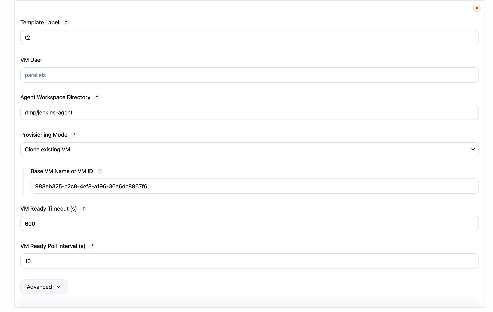
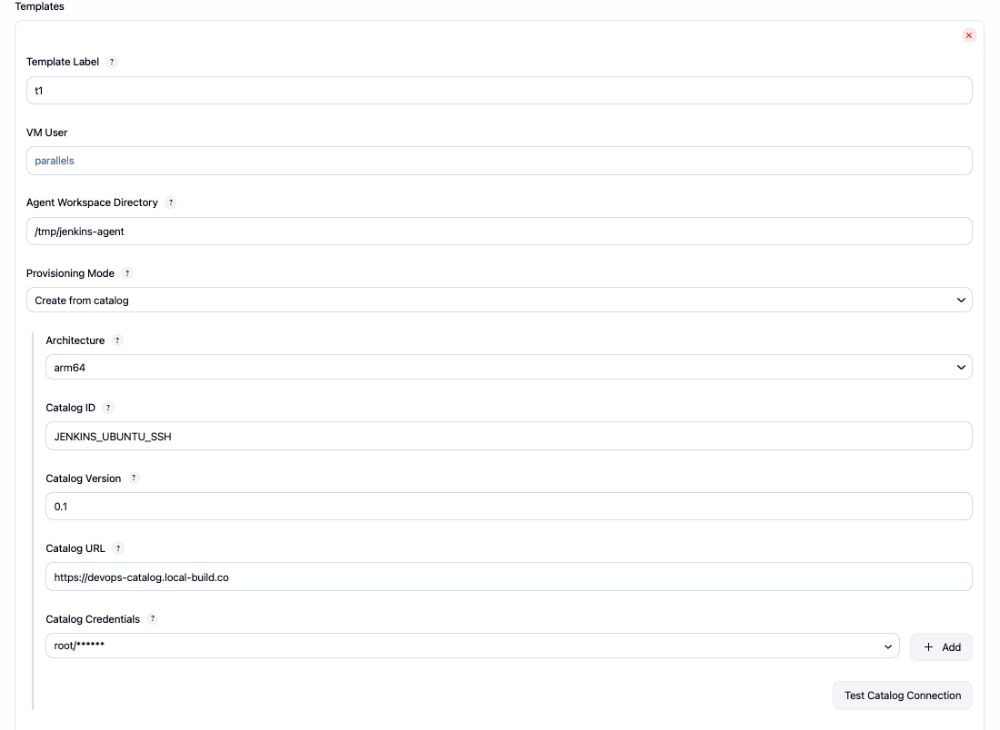

# Parallels DevOps

[](https://github.com/Parallels/parallels-devops-jenkins-plugin/actions/workflows/ci.yml)
[](https://github.com/Parallels/parallels-devops-jenkins-plugin/actions/workflows/release.yml)

The Parallels DevOps plugin allows Jenkins to start ephemeral macOS, Windows, and Linux build agents on demand through [Parallels DevOps Service](https://parallels.github.io/prl-devops-service/quick-start/).

When Jenkins detects queued work for a matching label, the plugin provisions a VM, waits for it to become ready, connects it as an inbound Jenkins agent, runs the build, and removes the VM when the one-shot agent is finished.

## Table of contents

- [Parallels DevOps](#parallels-devops)
  - [Table of contents](#table-of-contents)
  - [Introduction](#introduction)
  - [Features](#features)
  - [Getting started](#getting-started)
  - [Usage](#usage)
    - [Create a cloud](#create-a-cloud)
    - [Configure a template](#configure-a-template)
      - [Clone existing VM](#clone-existing-vm)
      - [Create from catalog](#create-from-catalog)
    - [Run jobs on provisioned agents](#run-jobs-on-provisioned-agents)
  - [Configuration as Code](#configuration-as-code)
  - [Behavior and troubleshooting](#behavior-and-troubleshooting)
    - [VM is running, but the build is still queued](#vm-is-running-but-the-build-is-still-queued)
    - [Jobs using different labels still wait behind each other](#jobs-using-different-labels-still-wait-behind-each-other)
    - [Cleanup may happen later than the end of the build](#cleanup-may-happen-later-than-the-end-of-the-build)
    - [Choosing timeout and poll settings](#choosing-timeout-and-poll-settings)
  - [Development](#development)
  - [Change log](#change-log)

## Introduction

This plugin integrates Jenkins with Parallels DevOps Service so that agents are provisioned only when they are needed.

Supported workflows include:

- cloning an existing VM from a Parallels DevOps host
- creating a VM from a Parallels catalog image through an orchestrator
- connecting the new VM as an inbound Jenkins agent (VM connects to Jenkins)
- removing the VM automatically after a one-shot build completes

The plugin is designed for elastic build fleets where different jobs may need different operating systems, architectures, or golden images.

## Features

- Dynamic provisioning of Jenkins agents from Parallels DevOps Service
- Support for both `HOST` and `ORCHESTRATOR` connection modes
- Per-template label routing so jobs can request the right image
- Two provisioning modes: clone an existing VM or create from catalog
- Inbound agent architecture (VMs connect TO Jenkins, works through NAT/firewalls)
- Configurable VM readiness timeout and polling interval
- Configurable agent bootstrap settings (Java path, JVM options, connection timeout)
- Automatic cleanup of one-shot agents and their backing VMs
- Configuration as Code coverage for both clone and catalog setups

## Getting started

Before configuring the plugin in Jenkins, make sure you have:

1. A reachable Parallels DevOps Service endpoint.
2. Jenkins credentials for the Parallels DevOps API.
3. Jenkins URL configured (Manage Jenkins → System → Jenkins Location) so VMs can connect back to Jenkins.
4. At least one VM source, either:
     - an existing base VM registered in Parallels DevOps Service, or
     - a Parallels catalog entry that can be used to create a VM.

Jobs are routed by label, so each template should use a label that clearly maps to an operating system or workload, for example `macos`, `windows11`, or `ubuntu-arm64`.

## Usage

### Create a cloud

Navigate to **Manage Jenkins** -> **Clouds** -> **New cloud** and choose **Parallels Devops Cloud**.


After the cloud is created, configure these top-level fields:

- `Name`: the Jenkins name for this cloud configuration
- `Service URL`: base URL of the Parallels DevOps Service instance
- `API Credentials`: secret text bearer token or username/password credentials
- `Connection Mode`:
  - `HOST` connects directly to a single Parallels DevOps host
  - `ORCHESTRATOR` connects to an orchestrator managing a fleet of hosts
- `Max Concurrent Agents`: maximum number of VMs that may be alive at the same time for this cloud

Use **Test Connection** before saving.


### Configure a template

Each template represents one type of agent Jenkins may provision.

At the template level, configure:

- `Template Label`: the Jenkins label that jobs will request
- `VM User`: OS user account for executing bootstrap commands on the VM
- `Agent Workspace Directory`: remote workspace path on the agent VM
- `Provisioning Mode`: choose how the VM is created
- `VM Ready Timeout (s)`: maximum time to wait for the VM to become usable
- `VM Ready Poll Interval (s)`: how often Jenkins checks VM readiness



Expand **Advanced** to configure:

- `Agent Connection Timeout (s)`: maximum time to wait for the inbound agent to connect
- `Java Path`: path to Java executable on the VM (default: `java`)
- `JVM Options`: extra JVM flags for the agent process (e.g., `-Xmx512m`)

The plugin supports two provisioning modes.

#### Clone existing VM

Use this mode when you already have a prepared VM on a Parallels DevOps host and want Jenkins to clone it per build.

Required field:

- `Base VM Name or VM ID`

This is usually the simplest path when you maintain your own golden images on a host.

#### Create from catalog

Use this mode when your images come from a Parallels catalog. [Learn more](https://parallels.github.io/prl-devops-service/docs/devops/catalog/overview/)

Typical fields include:

- `Architecture`
- `Catalog ID`
- `Catalog Version`
- `Catalog URL`
- `Catalog Credentials`

This is the better fit when you want centrally managed images and orchestrated provisioning.




### Run jobs on provisioned agents

Once a template is saved, use its label in Jenkins jobs or pipelines.

For Declarative Pipeline:

```groovy
pipeline {
        agent { label 't1' }

        stages {
                stage('Verify environment') {
                        steps {
                                sh 'uname -a'
                        }
                }
        }
}
```

For Scripted Pipeline:

```groovy
node('ubuntu-arm64') {
        sh 'hostname'
        sh 'java -version'
}
```

For freestyle jobs, set **Restrict where this project can be run** to the template label.

After provisioning succeeds, the cloud appears in Jenkins and jobs run on dynamically created nodes.


## Configuration as Code

The plugin supports Jenkins Configuration as Code for both provisioning modes.

Example for clone mode:

```yaml
jenkins:
    clouds:
        - parallelsDevops:
                name: "test-clone-cloud"
                serviceUrl: "http://test-service.invalid:8080"
                credentialsId: "test-credentials-id"
                connectionMode: "HOST"
                maxAgents: 5
                templates:
                    - templateLabel: "test-label"
                        vmUser: "test-user"
                        agentWorkspaceDir: "/tmp/test-workspace"
                        numExecutors: 2
                        vmReadyTimeoutSeconds: 300
                        vmReadyPollIntervalSeconds: 10
                        provisioningConfig:
                            clone:
                                baseVmName: "test-base-vm"
```

Example for catalog mode:

```yaml
jenkins:
    clouds:
        - parallelsDevops:
                name: "test-catalog-cloud"
                serviceUrl: "http://test-orchestrator.invalid:8080"
                credentialsId: "test-credentials-id"
                connectionMode: "ORCHESTRATOR"
                maxAgents: 3
                templates:
                    - templateLabel: "test-label"
                        vmUser: "test-user"
                        agentWorkspaceDir: "/tmp/test-workspace"
                        numExecutors: 1
                        vmReadyTimeoutSeconds: 600
                        vmReadyPollIntervalSeconds: 15
                        provisioningConfig:
                            catalog:
                                catalogId: "test-catalog-id"
                                catalogUrl: "http://test-catalog.invalid"
                                architecture: "x86_64"
                                catalogVersion: "latest"
```

## Behavior and troubleshooting

### VM is running, but the build is still queued

The build starts only after the VM has connected to Jenkins as an inbound agent. A VM may already exist in Parallels DevOps Service while Jenkins is still:

- waiting for the VM to report a valid IP address
- waiting for the guest to become ready
- waiting for the inbound agent to download agent.jar and connect

If this happens, inspect the Jenkins node launch log for the provisioned `prl-...` node.

### Jobs using different labels still wait behind each other

`Max Concurrent Agents` is enforced at the cloud level, not per template. If a cloud is limited to `1`, only one VM can be active at a time even when jobs target different template labels.

### Cleanup may happen later than the end of the build

Normal one-shot cleanup happens when the build completes. There is also a background reconciler that removes stale or failed offline nodes on a periodic schedule, so delayed cleanup can happen after a failed or incomplete launch.

### Choosing timeout and poll settings

If images boot quickly but Jenkins feels slow to pick them up, reducing `VM Ready Poll Interval (s)` can make readiness detection more responsive. If images need extra boot time or cloud-init work, increase `VM Ready Timeout (s)` instead.

## Development

The README is focused on installation and usage on the Jenkins plugin site.

For local development, testing, and packaging instructions, see [CONTRIBUTING.md](CONTRIBUTING.md).

Additional project-specific setup notes are available in [docs/setup-guide.md](docs/setup-guide.md).

## Change log

Releases and changelog entries are published through [GitHub Releases](https://github.com/Parallels/parallels-devops-jenkins-plugin/releases).
